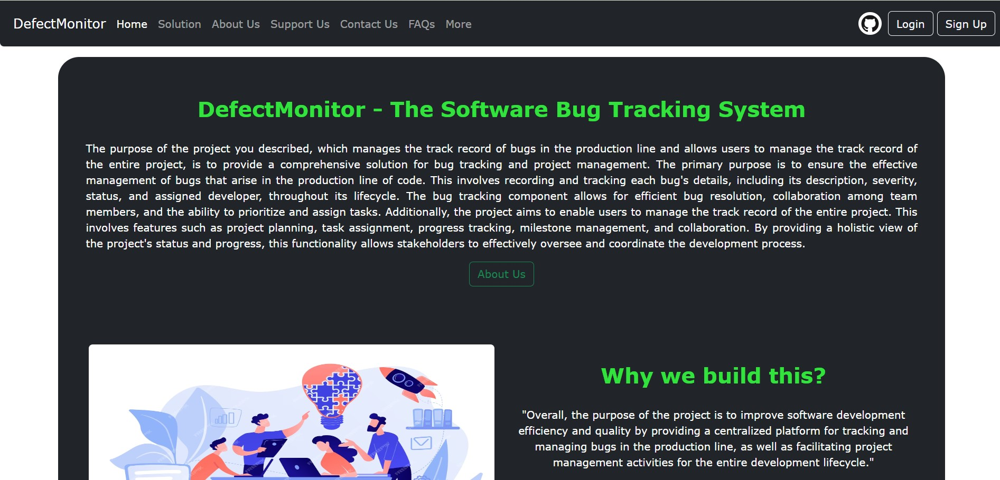

# Bug Monitor 🐞

Welcome to Bug Monitor, your gateway to efficient project management for entry-level programmers!

## Dive into Project Management with Bug Monitor! 🚀

Bug Monitor is a user-friendly tool designed to provide a seamless project management experience, tailored for entry-level programmers. With features reminiscent of Jira, Bug Monitor empowers you to master task tracking, collaboration, and customization—all within a sleek and intuitive interface.

## Key Features:

- **Intuitive UI:** Easy navigation for a hassle-free experience.
- **Ease of use:** Easily manage your workflow through easy task distribution.
- **Task Tracking:** Effortlessly create, assign, and monitor tasks.
- **Collaboration:** Streamline teamwork with robust communication features like chat.
- **Customization:** Tailor workflows and settings to fit your needs.

## Pics :



## Getting Started:

1. **Clone the Repository:**
   ```bash
   git clone https://github.com/Ayush-n25/Bug-Tracker.git
   ```

2. **Installation:**
   ```bash
   # Navigate to the project directory
   cd Final

   # Install dependencies
   npm install
   ```

3. **Usage:**
   - Customize Bug Monitor to suit your project needs.
   - Start tracking tasks and collaborating with your team effortlessly.

## Contribute:

Bug Monitor is an open-source project, and we welcome contributions! If you have ideas for improvement or find any bugs, feel free to [open an issue](#) or submit a pull request.
